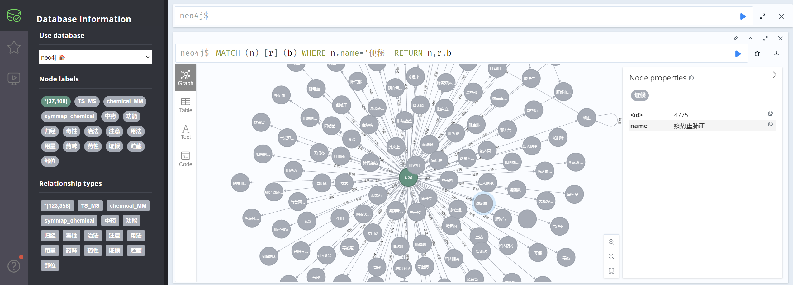

# 中医TCM-neo4j 知识图谱

## 1、配置

Neo4j下载：https://neo4j.com/download-center/	

版本为社区版5.7.0（需要jdk17）


## 2、运行

修改Create_Graph.py文件中的数据库的账号和密码，并运行Create_Graph.py，浏览器中打开http://localhost:7474即可查看


## 3、查询

由于数据集的节点数过大，不能对知识图谱进行完全地展示

通过

```
MATCH (n)-[r]-(b) Where n.name='便秘' RETURN n,r,b
```

对$n.name$进行修改可以查询与需要节点相关的节点

查询“便秘”症状节点的KG示例：


